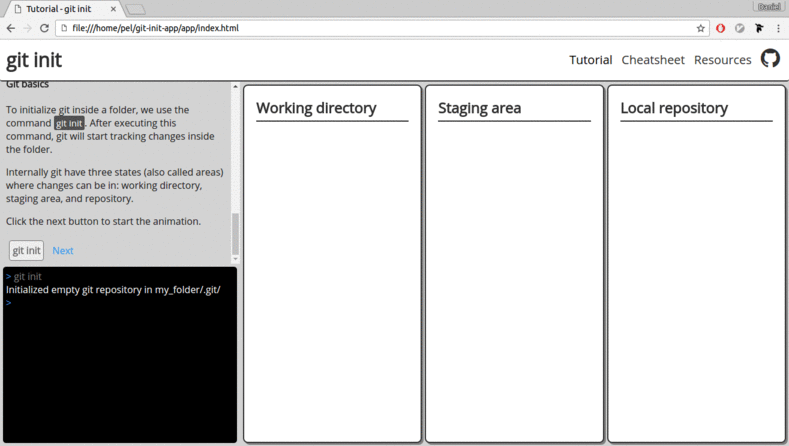
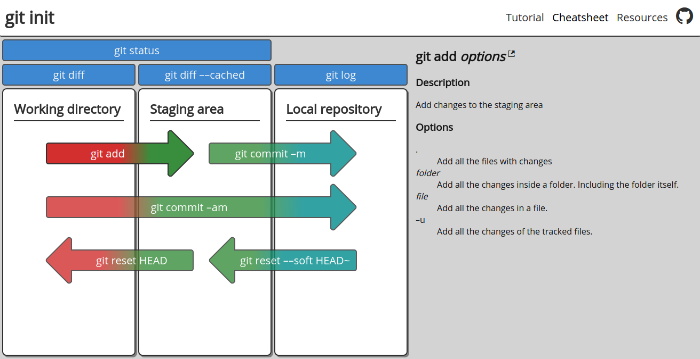

# Git init

Resources to learn the basics of git ([link](https://pel-daniel.github.io/git-init)).
Includes a tutorial, a cheatsheet, and some links to more advanced resources.

## Tutorial

The tutorial explains the basic git commands through animations. Currently includes
the commands: init, add, commit, status, diff, log.

## Cheatsheet

